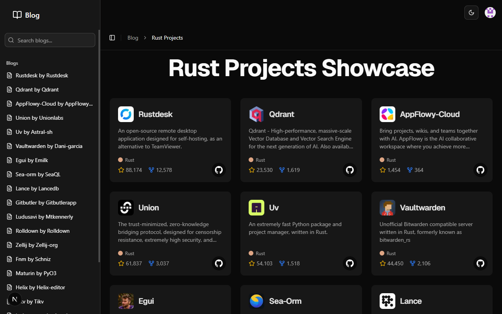

# AlterEgo

## 🧑‍💻 Project Description

AlterEgo is a web application designed to help users discover Rust-based alternatives for their favorite software tools and libraries. It addresses the growing need for high-performance and memory-safe applications by curating a collection of Rust projects. Users can browse detailed project information, including features, licenses, and platform compatibility. The main goal is to provide a centralized platform for exploring the Rust ecosystem and finding suitable replacements for existing tools, thereby promoting the adoption of Rust.

## 🔐 Use of Clerk

Clerk is integrated into AlterEgo for robust user authentication and session management. It handles the sign-in and sign-up processes, allowing users to create accounts and securely access the platform. Clerk's middleware is used to protect routes and manage user sessions across the application. The integration simplifies user management by leveraging Clerk's pre-built UI components for authentication flows, ensuring a seamless and secure experience for users.

## 🚀 Demo

[https://alternego.vercel.app/](https://alternego.vercel.app/)

## 📸 Screenshots



## 🔍 Features

- 🔍 **Browse Rust Alternatives:** Find Rust-based replacements for popular tools and libraries.
- 📝 **Project Info & Features:** Detailed project cards with license, platforms, and key features.
- 📰 **Blog/Content:** Dynamic blog/content system powered by local content directories and JSON data.
- 🦾 **Authentication:** Integrated with Clerk for user sign-in.
- 🎨 **UI/UX:** Built with Shadcn UI, Radix, Tailwind CSS, and Sonner for toasts.
- ⚡ **Performance:** Uses Next.js App Router, React Server Components, and optimized image loading.

## 🛠 Tech Stack

- [Next.js](https://nextjs.org/) (App Router, SSR, RSC)
- [TypeScript](https://www.typescriptlang.org/)
- [Shadcn UI](https://ui.shadcn.com/), [Radix UI](https://www.radix-ui.com/)
- [Tailwind CSS](https://tailwindcss.com/)
- [Sonner](https://sonner.emilkowal.ski/) for notifications
- [Clerk](https://clerk.com/) for authentication
- [pnpm](https://pnpm.io/) for package management

## 🚀 Getting Started

### Prerequisites

- Node.js v18+
- pnpm

### Install

```bash
pnpm install
```

### Development

```bash
pnpm dev
```
Visit [http://localhost:3000](http://localhost:3000)

### Build

```bash
pnpm build
```

### Lint & Format

```bash
pnpm lint
pnpm format
```

## 🤝 Contributing

1. Fork and create a feature branch.
2. Use TypeScript, functional components, and Tailwind CSS.
3. Follow code style and conventions (see `/src/types` and `/src/components`).
4. Run lint and format before submitting a PR.

## 📄 License

MIT